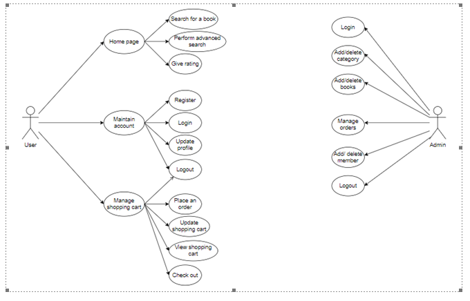
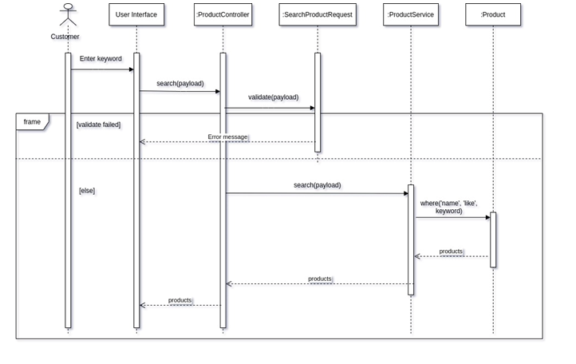

<h1 align="center">
    
    BOOKEPT
</h1>

## Demo
[Demo website link](https://bookept.herokuapp.com)

## Feature
✔ User interface
  - Multi authenticate user
  - Add products to cart
  - Order cart
  - Search products
  - Contact message
✔ Admin dashboard
  - Products management
  - Orders management
  - Users management
  - Messages management

## Diagram & analysis
<table>
  <tr>
    <td align="center">
      
      <a href="./docs/ERD_diagram.png">Entities Relation Diagram</a>
    </td>
  </tr>
  <tr>
    <td align="center">
      
      <a href="./docs/class_diagram.png">Class Diagram</a>
    </td>
  </tr>
  <tr>
    <td align="center">
      
      <a href="./docs/usecase_diagram.png">Usecase Diagram</a>
    </td>
    <td align="center">
      
      <a href="./docs/sequence_diagram1.png">Sequence Diagram 1</a>
    </td>
  </tr>
  <tr>
    <td align="center">
      
      <a href="./docs/sequence_diagram2.png">Sequence Diagram 2</a>
    </td>
    <td align="center">
      
      <a href="./docs/sequence_diagram3.png">Sequence Diagram 3</a>
    </td>
  </tr>
</table>

## Reference
+ [checkout-template](https://www.bolt.com/thinkshop/checkout-page-best-practices-templates-examples-to-end-abandonment)

## Extension
- Relax with [bee-music](https://github.com/thuongtruong1009/bee-music)
- Enhance front-end skills through [twitter-meta](https://github.com/thuongtruong1009/twitter-meta)
- Generate your GitHub informations by [gitbox](https://github.com/thuongtruong1009/gitbox)
- Begining Vue through [notedev](https://github.com/thuongtruong1009/notedev)
- Learning front-end web full course at [frontend-master](https://github.com/thuongtruong1009/frontend-master)
- Learn Object-Oriented-Programming tutorial at [Snake-Game-OOP](https://github.com/thuongtruong1009/Snake-Game-OOP)
- Become Java master for new beginner at [Java-training](https://github.com/thuongtruong1009/java-oop-training)
- Pratice UI/UX at [league-fo-legend](https://github.com/thuongtruong1009/league-of-legends-clone)
- Make flip card game at [flip-card](https://github.com/thuongtruong1009/flip-cards)
- Learn computer architecture at [computer-architecture](https://github.com/thuongtruong1009/computer-architecture)

### ❤️ Support me

<a href='https://ko-fi.com/thuongtruong1009' target='_blank'>
